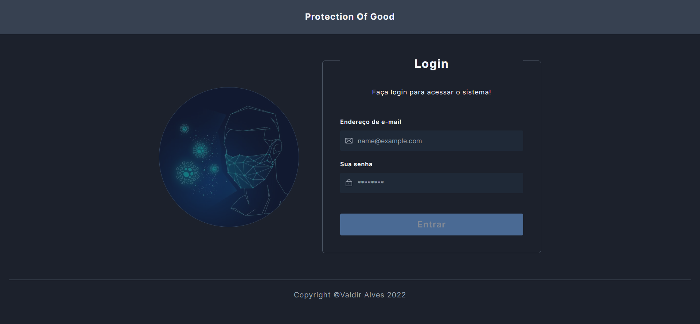

# Protection Of Good



## Description

Este Projeto busca contribuir com o controle de casos de pessoas infectadas por doenças contagiosas.

Por meio de registro de localizações dos usuários com leitura de QRCode. No intuito de notificalos em casos de contato com pessoas contaminadas.

## Installation

Clone o projeto

```bash
  git clone https://github.com/valdir-alves3000/pi-viii.git
```

Entre no diretório do projeto

```bash
  cd pi-viii/frontend
```

Instale as dependências

```bash
  npm install
```

## Running the app

```bash
  npm run dev
```

## Technologies

- [Axios](https://www.npmjs.com/package/axios)
- [Clsx](https://www.npmjs.com/package/clsx)
- [Nookies](https://www.npmjs.com/package/nookies)
- [Phosphor React](https://www.npmjs.com/package/phosphor-react)
- [QrCode](https://www.npmjs.com/package/qrcode)
- [Radix UI - React Slot](https://www.radix-ui.com/docs/primitives/utilities/slot#slot)
- [Sweetalert 2](https://sweetalert2.github.io/v9.html)
- [Tailwindcss](https://tailwindcss.com/docs/installation)
- [Vite](https://vitejs.dev/)

## Author

<a href="https://github.com/valdir-alves3000/">
 
 <br />
 <sub style="margin-right: 1rem;"><b>Valdir Alves </b></sub>🚀</a>

<p style="margin-top: 0.5rem;">Feito com ❤️ por Valdir Alves. Entre em contato!</p>

[](http://linkedin.com/in/valdiralves3000)
[](mailto:valdiralves3000@gmail.com)
